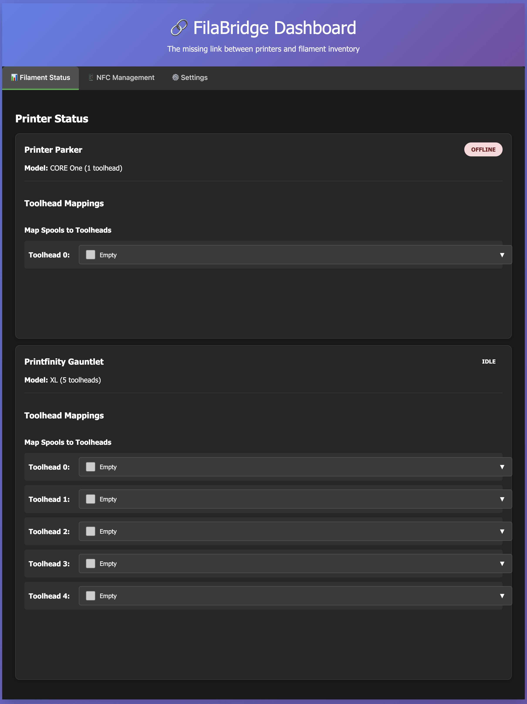

# FilaBridge

[](https://www.gnu.org/licenses/gpl-3.0)
[](https://golang.org/)
[](https://github.com/needo37/filabridge/releases)

A high-performance Go microservice that bridges PrusaLink-compatible printers and Spoolman for (mostly) automatic filament inventory management. Originally designed for Prusa printers (CORE One, XL, MK4, etc.) but works with any printer that supports the PrusaLink API.

### The Problem

I run multiple 3D printers and use Spoolman to track my filament inventory. The issue? I had to manually update filament usage after every print. With multi-material prints on my Prusa XL, this was getting tedious and error-prone.

## Features

- 🔗 **PrusaLink Compatibility**: Works with any PrusaLink-compatible printer (Prusa CORE One, XL, MK4, Mini, and more)
- 📊 **Real-time Dashboard**: Web interface to view printer status and manage filament mappings
- 🎯 **Multi-Toolhead Support**: Seamlessly handles single and multi-toolhead printers (tested with 5-toolhead Prusa XL)
- 📈 **Smart Usage Tracking**: Automatically parses G-code files to accurately track filament consumption per toolhead
- 💾 **Persistent Storage**: SQLite database stores toolhead mappings and complete print history
- ⚡ **High Performance**: Single lightweight binary, minimal resource usage, fast execution
- 🔧 **Web-based Config**: No config files needed - manage everything through the web UI

## Why FilaBridge?

Managing filament inventory across multiple 3D printers is tedious. FilaBridge automates this by:
- Monitoring your printers in real-time
- Tracking which spools are loaded on which toolheads
- Automatically updating your Spoolman inventory when prints complete
- Providing accurate filament usage by parsing G-code files

No more manual updates or guesswork about remaining filament!

## Screenshot


*FilaBridge web interface showing printer status and filament mappings*

## Prerequisites

- A PrusaLink-compatible 3D printer (Prusa or any printer with PrusaLink API)
- PrusaLink enabled on your printer(s) for local network access
- Spoolman
- **For building from source**: Go 1.23 or higher

## Installation

### Option 1: Pre-built Binary (Easiest)

1. **Download the latest release** for your platform from the [Releases page](https://github.com/needo37/filabridge/releases)
   - Linux (amd64, arm64)
   - macOS (amd64/Intel, arm64/Apple Silicon)
   - Windows (amd64)

2. **Make it executable** (Linux/macOS):
   ```bash
   chmod +x filabridge
   ```

3. **Run Spoolman** (if not already running):
   ```bash
   docker run -d --name spoolman -p 8000:8000 -v spoolman-data:/home/spoolman/data ghcr.io/donkie/spoolman:latest
   ```

4. **Start FilaBridge**:
   ```bash
   ./filabridge
   ```

5. **Configure**: Open `http://localhost:5000` and click "⚙️ Configuration"

### Option 2: Build from Source

1. **Clone and build**:
   ```bash
   git clone https://github.com/needo37/filabridge.git
   cd filabridge
   go mod download
   go build -o filabridge .
   ```

2. **Run Spoolman** (if not already running):
   ```bash
   docker run -d --name spoolman -p 8000:8000 -v spoolman-data:/home/spoolman/data ghcr.io/donkie/spoolman:latest
   ```

3. **Start FilaBridge**:
   ```bash
   ./filabridge
   ```

## Configuration

The system stores all configuration in the SQLite database. No environment variables or configuration files are needed!

### First Run

1. Start the application
2. Open the web interface at `http://localhost:5000`
3. Click "Start Configuration" button
4. Enter a name for your Printer.
5. Enter your PrusaLink IP Address and API key
6. Choose the number of toolheads your printer has.
7. Click "Save Configuration"
8. The service will automatically restart with new settings

## Usage

### Running the Service

```bash
# Run both bridge service and web interface (recommended)
./filabridge

# Custom host and port
./filabridge --host 0.0.0.0 --port 8080
```

### Web Interface

The web interface provides:

- **Printer Status**: Real-time view of printer states and current jobs
- **Toolhead Mapping**: Assign filament spools to specific toolheads
- **Progress Monitoring**: Visual progress bars for active prints
- **Auto-refresh**: Updates every 30 seconds automatically

### Filament Management

1. **Add spools to Spoolman**: Use Spoolman's web interface to add your filament spools
2. **Map spools to toolheads**: Use the FilaBridge web interface to assign spools
3. **Monitor usage**: The system automatically tracks and updates filament usage

## API Endpoints

The web interface also provides REST API endpoints:

- `GET /api/status` - Get current printer status and mappings
- `GET /api/spools` - Get all spools from Spoolman
- `POST /api/map_toolhead` - Map a spool to a toolhead
- `POST /api/unmap_toolhead` - Unmap a spool from a toolhead

## Project Structure

```
filabridge/
├── main.go                 # Application entry point
├── config.go              # Configuration management
├── prusalink.go           # PrusaLink API client
├── spoolman.go            # Spoolman API client
├── bridge.go              # Core monitoring and tracking logic
├── web.go                 # HTTP server and web interface
├── templates/             # HTML templates
├── go.mod                 # Go module definition
└── README.md              # Documentation
```

## Troubleshooting

### Common Issues

1. **Printers not accessible**:
   - Check IP addresses in the web interface configuration
   - Ensure PrusaLink is enabled on both printers
   - Verify network connectivity

2. **Spoolman connection failed**:
   - Make sure Spoolman is running
   - Check the Spoolman URL in the web interface configuration
   - Verify Spoolman is accessible at the specified URL

3. **Filament usage not tracked**:
   - Ensure spools are mapped to toolheads
   - Check that prints are completing (not just pausing)
   - Verify PrusaLink API is returning filament usage data

### Logs

The service logs important events to the console. Look for:
- Printer status updates
- Filament usage calculations
- Spoolman update confirmations
- Error messages

## Development

### Building from Source

```bash
# Download dependencies
go mod download

# Build the application
go build -o filabridge .

# Run tests
go test ./...

# Run with race detection
go run -race .
```

## Contributing

Contributions are welcome! Here's how you can help:

- 🐛 **Report bugs**: Open an issue with details about the problem
- 💡 **Suggest features**: Share your ideas for improvements
- 🔧 **Submit PRs**: Fix bugs or add features (please open an issue first for major changes)
- 📖 **Improve docs**: Help make the documentation clearer
- ⭐ **Star the repo**: Show your support!

See [CONTRIBUTING.md](CONTRIBUTING.md) for detailed guidelines.

## Roadmap

- [ ] Support for additional printer APIs
- [ ] Provide a Docker Image
- [ ] NFC Support
- [ ] Mobile-responsive UI improvements

## Support the Project

If you find FilaBridge useful:
- ⭐ Star the repository
- 🐛 Report bugs and suggest features
- 📢 Share it with the 3D printing community
- 🤝 Contribute code or documentation

## License

This project is licensed under the GNU General Public License v3.0 - see the [LICENSE](LICENSE) file for details.

## Support

For issues specific to:
- **PrusaLink**: Check Prusa's documentation
- **Spoolman**: Visit the [Spoolman GitHub repository](https://github.com/pdrd/spoolman)
- **This bridge**: Open an issue in this repository
